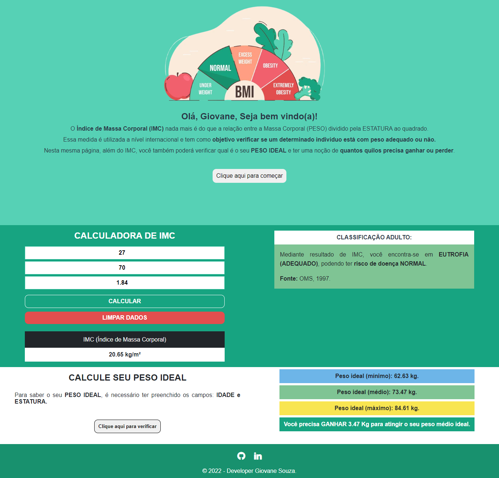
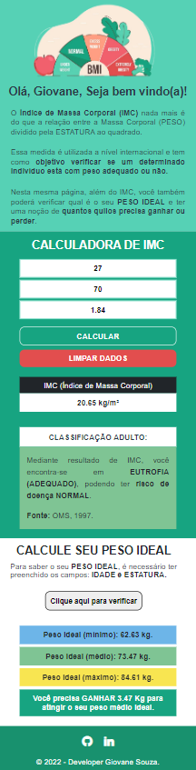

# Calculadora de IMC

## Sobre o projeto

Por meio deste projeto é possível realizar o cálculo do <strong>Índice de Massa Corporal</strong> (IMC) de todas as faixas etárias, havendo apenas restrição na classificação de crianças e adolescentes que tem como base a tabela de curva disponibilizado pela <strong>Organização Mundial da Saúde</strong> OMS.

Além disso, ainda é possível verificar qual é o peso ideal para o indivíduo e verificar se o mesmo precisa ganhar ou perder massa.

## Tecnologias utilizadas

* HTML
* CSS
* JAVASCRIPT

## Resultados obtidos

### Layout Web

### Layout Mobile
